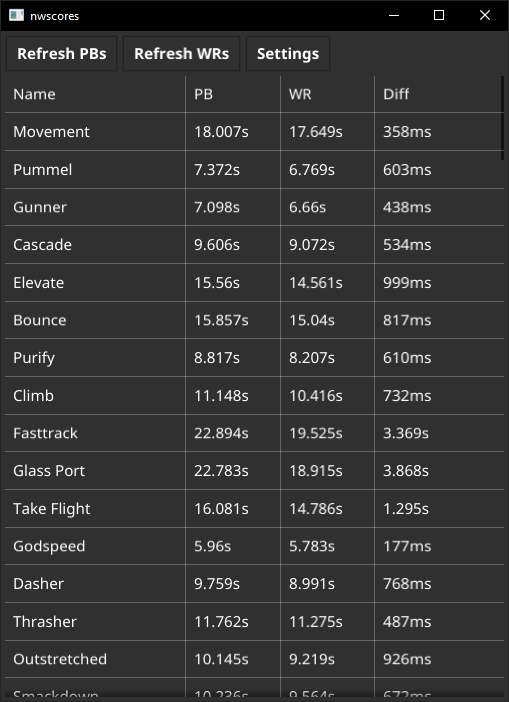
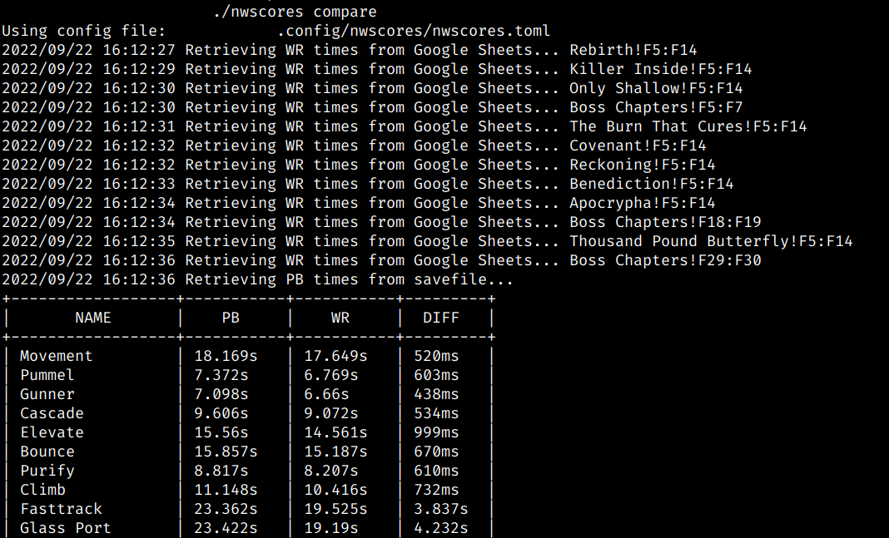

# Building
Goreleaser is broken right now because of CGO requirement of new gui feature

Build like this:
`go build -ldflags '-s -w -H windowsgui' .`
Linux
`go build -ldflags '-s -w' .`

# Usage

Populate your config file with a working Google Sheets API key and the path to
your Neon White save. It's probably like this:
`C:\Users\user\AppData\LocalLow\Little Flag Software, LLC\Neon
White\<steamid>\savedata.dat`

nwscores now has a Fyne gui mode which will run if you invoke command with no args

You can use this as a cli tool too:
`$ nwscores compare`

There is also a command for running the HTTP server that provides WR times

`$ nwscores wrs`

It will listen on 8000 and can be reverse proxied by whatever you like
Every hour it'll scrape the Google Sheets and update itself

There is a docker container for convenience and you can provide the Sheets API
key as an env var

`docker build -t nwscores .`
`docker run -e NWSCORES_WRS_SHEETS_APIKEY=AIza..... nwscores nwscores wrs`

The default URL built into application is
`https://nwscores.fuckhole.org/wrs.json` so you will see it make requests here
The code which unmarshals it can be found in lib/parsewrs.go

You can set your own endpoint or force it to fall back on the Google Sheets
scraper in your config file

If the sheet ever changes URL or WR positions you can update them in the config
without rebuilding but no changes needed for now
